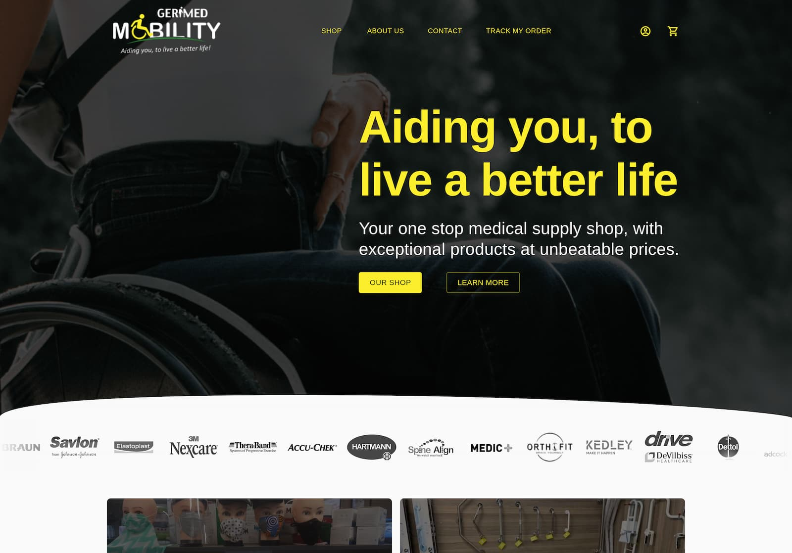
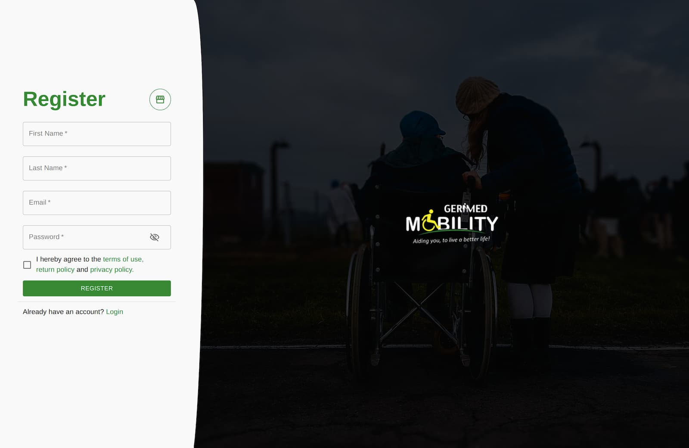
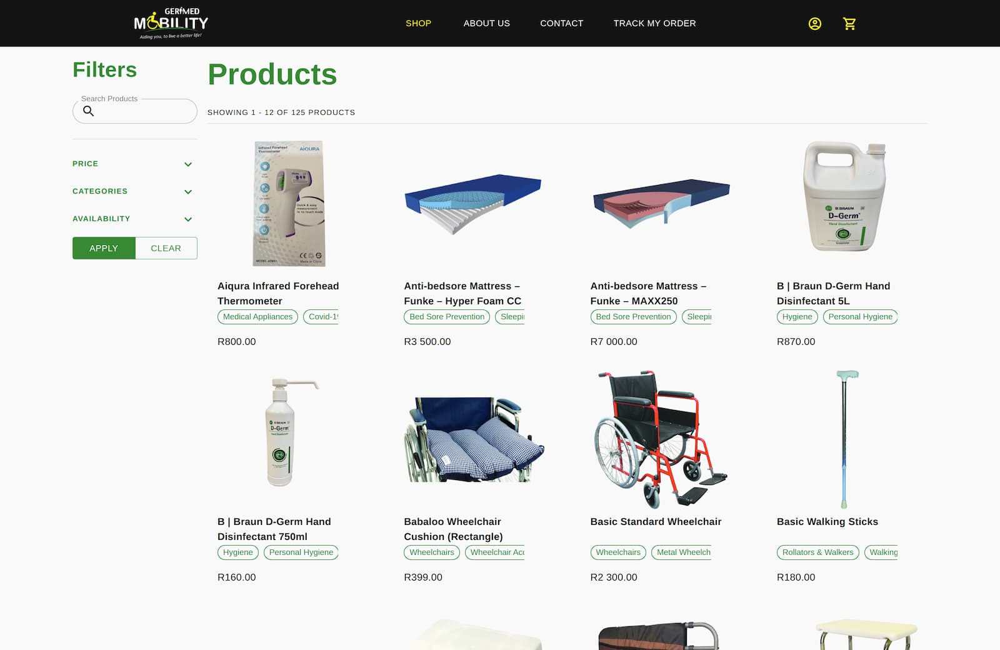

# Gerimed Mobility storefront

Gerimed Mobility is a local medical supply shop operating out of Langebaan. They have been in business since 2001 and needed an online shop to cater to their user's needs. As ambitious as I was, I built the entire frontend from the ground up, creating the backend with Strapi and custom plugins.

## Screenshots

 

 

## Tech Stack

**Client:**

## Related

Previous iterations of this project.

- [Gerimed-mobility-v1](https://github.com/IamStephan/gerimed-mobility-v1)
- [Gerimed-mobility-v2](https://github.com/IamStephan/gerimed-mobility-v2)

